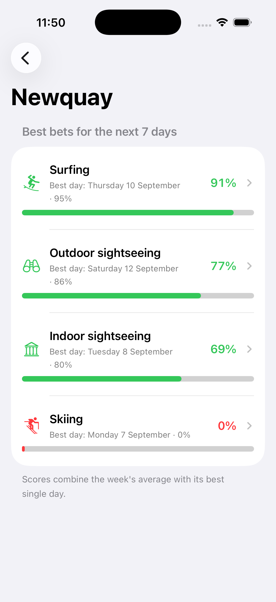
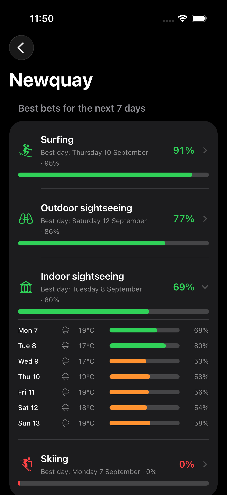

# DoToday

Search for a city, see which of four activities — **skiing, surfing, outdoor sightseeing, indoor sightseeing** — best suits its weather over the next seven days.

Built for the Senior / Lead Mobile Engineer exercise. iOS, Swift, SwiftUI.

---

## 1. Project overview

The app has two screens:

1. **City search** — a debounced search field backed by Open-Meteo's geocoding API, with recently-viewed cities persisted beneath it.
2. **Recommendations** — the four activities ranked best-first for the selected city, each with a headline score, its best day, and an expandable seven-day breakdown showing the weather behind each daily score.

Supporting behaviour: recent searches (persisted, de-duplicated, swipe-to-delete), offline forecast cache with a stale-data badge, pull-to-refresh, explicit error states with contextual retry, full VoiceOver labelling, and dark mode.

| Search | Ranking | Daily breakdown (dark) |
|---|---|---|
|  |  |  |

*Newquay, Cornwall: surfing ranks first, skiing is zeroed by the temperature limiter.*

---

## 2. Platform and tooling choices

| Choice | Rationale |
|---|---|
| **iOS / Swift** | Deeper personal fluency; the exercise asks for one platform, not both. |
| **SwiftUI** | Declarative views make "the screen is a pure function of state" enforceable rather than aspirational, which is the backbone of the testing strategy below. |
| **Swift 6 language mode**, strict concurrency | The project template shipped in Swift 5 mode. It was moved to Swift 6 and builds with **zero warnings**: data-race safety is checked at compile time rather than hoped for. |
| **`SWIFT_DEFAULT_ACTOR_ISOLATION = nonisolated`** | The template defaulted the whole module to `@MainActor`, which would have quietly pinned the domain and data layers to the main thread. Isolation is now opt-in: presentation types declare `@MainActor` explicitly; domain and data types are `Sendable` and isolation-agnostic. |
| **async/await** | Structured concurrency gives cancellation for free, which the search-as-you-type flow depends on. Combine would have added an operator vocabulary for no benefit here. |
| **Swift Testing** (unit) + **XCTest** (UI) | Swift Testing's `@Test(arguments:)` expresses the table-driven scoring tests compactly; XCUITest remains the only option for UI tests. |
| **No third-party dependencies** | Nothing here needs one. Hand-written test doubles over a mocking framework: the protocols are small, and explicit stubs read better than a DSL. |
| **Manual dependency injection** | The graph is ~10 objects. A DI container would add runtime resolution failures in exchange for wiring that is currently greppable and compile-time checked. |

**Requirements:** developed and verified on **Xcode 26.4**; Xcode 16 or newer is required (Swift 6 language mode, Swift Testing, and the project's file-system synchronized groups). Deployment target is **iOS 17.0**, so it runs on any iOS 17+ simulator or device. No API key, no backend, no package resolution.

> The Xcode template generated this project with a deployment target of iOS 26.4, which would have restricted it to a single, very recent simulator runtime — the project would not have built for a reviewer on anything older. Nothing in the code needs it: the highest API floor is iOS 17 (`@Observable`, `ContentUnavailableView`). It was lowered to 17.0 and the full suite re-run on an older runtime to confirm.

---

## 3. Architecture and technical decisions

Clean Architecture with MVVM in the presentation layer. Dependencies point **inwards only** — the domain layer imports nothing but `Foundation`.

```
┌─────────────────────────── Presentation ───────────────────────────┐
│  CitySearchView            RecommendationsView      (SwiftUI)      │
│  CitySearchViewModel       RecommendationsViewModel (@MainActor)   │
│  ViewState<Value>          Formatters, components                  │
└──────────────────────────────┬─────────────────────────────────────┘
                               │ depends on protocols
┌──────────────────────────────▼─────────────────────────────────────┐
│                            Domain                                  │
│  Entities      City, Forecast, DailyWeather, ActivityRanking …     │
│  Use cases     SearchCitiesUseCase, RankActivitiesUseCase          │
│  Scoring       ScoringCurve → ScoringCriterion →                   │
│                ActivityScoringProfile → ActivityScoringEngine      │
│                RecentCitiesUseCase (ordering, dedupe, cap)         │
│  Ports         CityRepository, ForecastRepository,                 │
│                RecentCitiesStore                    (protocols)    │
│  Errors        AppError                                            │
└──────────────────────────────▲─────────────────────────────────────┘
                               │ implements
┌──────────────────────────────┴─────────────────────────────────────┐
│                              Data                                  │
│  Repositories  DefaultCityRepository, DefaultForecastRepository    │
│  Mapping       CityMapper, ForecastMapper  (anti-corruption layer) │
│  Remote        Open-Meteo data sources + DTOs                      │
│  Networking    HTTPClient (protocol) → URLSessionHTTPClient        │
│  Cache         ForecastCache → FileForecastCache / InMemory…       │
│  Storage       UserDefaultsRecentCitiesStore + RecentCityDTO       │
└────────────────────────────────────────────────────────────────────┘
                               ▲
                       AppContainer (composition root)
```

### Key decisions

**Explicit state modelling.** Every data-driven screen holds exactly one `ViewState<Value>`:

```swift
enum ViewState<Value: Equatable>: Equatable {
    case idle, loading, loaded(Value), empty, failed(AppError)
}
```

Not `isLoading` + `data` + `error`. That triple has eight representable combinations, six of which are nonsense; this enum has five, all meaningful. Views `switch` exhaustively, so adding a state is a compile error until the UI handles it. `idle` and `empty` are separate on purpose: "you haven't typed enough yet" and "there is no such city" deserve different copy.

**A single error vocabulary.** `URLError`, HTTP status codes and `DecodingError` are translated into `AppError` at the repository boundary. ViewModels never see a transport type. Each case carries its own user-facing copy and an `isRetryable` flag, so the UI never offers a retry button for a failure that will deterministically recur (a parse error) — the error type decides, not the view.

**The scoring engine is pure and synchronous.** `rank(forecast:for:) -> [ActivityRanking]` takes values and returns values. It needs no test doubles at all, which is why the majority of the domain tests are three lines long.

**Cancellation is control flow, not failure.** `CancellationError` is propagated untouched through every layer — the HTTP client, the repositories, the ViewModels. A cancelled search must not overwrite newer state, and a cancelled forecast must not be silently satisfied from cache.

**Product rules live in the domain, not in the storage implementation.** The recent-search list is split deliberately: `RecentCitiesStore` is a dumb port that loads and saves an array, while `RecentCitiesUseCase` owns *what the list means* — most-recent-first, de-duplicated by city id, capped at five. Putting the ordering and cap in the `UserDefaults` implementation would have been fewer files, but a second backend (SwiftData, CloudKit) would then have to re-implement those rules and get them right again. The use case is an `actor`, because every operation is a read-modify-write and two concurrent selections against a plain struct could drop an entry — there is a test that would catch exactly that.

**The composition root is the only place that names a concrete type.** `AppContainer` builds the graph; everything else depends on protocols. That single fact is what makes the whole stack substitutable, and it is exercised for real — the UI tests swap in a stubbed `HTTPClient` through the same seam.

---

## 4. How to build and run

```bash
open DoToday.xcodeproj
```

Select the **DoToday** scheme and an iOS 26.4 simulator, then run (`⌘R`). There is nothing else to configure.

From the command line:

```bash
xcodebuild -project DoToday.xcodeproj -scheme DoToday -destination 'generic/platform=iOS Simulator' build
```

---

## 5. How to run tests & testing strategy

```bash
xcodebuild test -project DoToday.xcodeproj -scheme DoToday \
  -destination 'platform=iOS Simulator,name=iPhone 17 Pro'
```

Or `⌘U` in Xcode. Unit tests only (these are the fast, hermetic ones — the UI tests boot a simulator):

```bash
xcodebuild test -project DoToday.xcodeproj -scheme DoToday \
  -destination 'platform=iOS Simulator,name=iPhone 17 Pro' -only-testing:DoTodayTests
```

> Substitute any iOS 17+ simulator you have — the name above is just what I ran on. `xcodebuild -project DoToday.xcodeproj -scheme DoToday -showdestinations` lists the ones available to you.

**Current status: 137 unit tests across 20 suites, plus 8 UI tests. All passing, with zero compiler warnings.** Verified from a *fresh `git clone`* — not just an incremental build — on iOS 26.4, and the unit suite additionally on iOS 26.0. Unit tests run in ~0.35 s — no sleeps, no network, no shared state.

### What is tested, and why

| Area | Coverage |
|---|---|
| **`ScoringCurve`** | Every curve shape at its boundaries, midpoints and beyond; clamping to 0…1 across a ±1000 sweep; the zero-width-range case that would otherwise divide by zero. This is the primitive everything else is built from. |
| **`ActivityScoringEngine`** | That the right activity wins for the right weather (snowy alpine week → skiing; fine week → outdoor; washout → indoor beats outdoor); that missing measurements are *dropped rather than zeroed*; that limiting criteria zero an impossible activity; that the weekly blend and tie-breaking are deterministic. |
| **`LocationFeasibility`** | The elevation heuristic, including the "no data ⇒ no penalty" rule. |
| **Use cases** | Query-length gating and trimming, the seven-day window, cache-policy pass-through, the empty-forecast guard. |
| **`Formatters`** | That day labels are rendered in the *location's* time zone, not the device's (an instant that is the 5th in Los Angeles and the 6th in Tokyo must label differently); percentage clamping; and that a missing temperature shows a dash rather than a fabricated `0°`. |
| **Mapping** | Real JSON payloads: snake_case keys, absent `results`, `null`s inside daily arrays, **ragged arrays**, unparseable dates, unknown weather codes, and time-zone resolution (a Paris day must not be parsed in the device's zone). |
| **Networking** | URL construction including percent-encoding and locale-independent coordinate formatting (a comma decimal separator would 400 every request); the full `URLError` → `AppError` translation table. |
| **Recent searches** | The domain rules (most-recent-first, de-duplication by city id, the cap, removal, clearing, write-through to storage, and that concurrent selections don't lose entries) tested once against an in-memory store; and separately the `UserDefaults` boundary — full round trip, order, optional fields as `nil` rather than empty strings, corrupt data cleared, and an entry from a future schema skipped while its siblings still load. |
| **`DefaultForecastRepository`** | Every branch of the cache policy: fresh hit avoids the network, expired hit refetches, revalidate always fetches, offline falls back to stale data, offline with no cache throws, cancellation is not masked by a cache hit, cache keys are scoped per location and window. |
| **ViewModels** | State transitions for both screens, debounce collapsing a keystroke burst into one request, a superseded search being unable to clobber newer results, `loadIfNeeded` idempotence, and the rule that a failed *refresh* keeps existing content and reports separately. |
| **UI (XCUITest)** | The primary journey end-to-end: launch → search → select → ranking → expand a day breakdown; plus visiting a city adding it to recents, opening a city *from* recents (the one action that navigates and reorders the list at the same time), and clearing recents returning to the empty prompt. All against stubbed data. |

### Testing decisions worth calling out

- **Time is injected.** `DateProvider` and an explicit `retrievedAt` mean cache-expiry tests advance a clock instead of sleeping. No test in the suite waits on wall time.
- **Debounce is injected.** Tests run with `.zero` debounce; the debouncing behaviour itself is tested once, deliberately, with a real interval.
- **UI tests are offline and deterministic.** A `-UITestStubbedAPI` launch argument swaps in a canned `HTTPClient` (DEBUG-only, compiled out of release). A UI test that fails because it is summer in the Alps is worse than no UI test.
- **Fixtures default every parameter**, so each test states only the values it is actually about.
- **Persistence tests use a throwaway `UserDefaults` suite** per test, so they never touch real preferences and cannot leak state into one another.
- **The `CitySearchViewModel` tests use the *real* recents use case** over an in-memory store rather than a stub. Its rules are covered separately, and using the real one means those tests also prove the ViewModel is wired to it — which a stub would happily hide.

---

## 6. API usage notes

**Geocoding** — `GET https://geocoding-api.open-meteo.com/v1/search`
`name`, `count=15`, `language` (device language, falling back to `en`), `format=json`.

An unmatched query returns a body with **no `results` key at all** — not an empty array. This is modelled as `[PlaceDTO]?` and mapped to an empty list, which the UI renders as an empty state rather than an error.

**Forecast** — `GET https://api.open-meteo.com/v1/forecast`
`latitude`, `longitude`, `forecast_days=7`, `timezone=auto`, and these `daily` variables:

`weather_code`, `temperature_2m_max`, `apparent_temperature_max`, `precipitation_sum`, `rain_sum`, `snowfall_sum`, `precipitation_probability_max`, `wind_speed_10m_max`, `wind_gusts_10m_max`, `sunshine_duration`, `daylight_duration`

Every variable requested is consumed — ten by a scoring criterion, `weather_code` by the day-strip icon and its VoiceOver label. Nothing is fetched "just in case", and there is a test (`noVariableIsFetchedSpeculatively`) that fails if that stops being true.

Three properties of this API drove real code:

1. **Units are pinned explicitly** (`temperature_unit=celsius`, `wind_speed_unit=kmh`, `precipitation_unit=mm`) because the scoring curves' constants are meaningless without them.
2. **`timezone=auto`** makes the API resolve calendar days at the *destination*. "The next 7 days" means days where you are going, not days where your phone is. `ForecastMapper` parses the bare `"2026-09-07"` strings using the time zone the response itself reports.
3. **Responses are parallel arrays that may contain `null`,** and nothing in the contract guarantees they are all the same length as `time`. Every read is bounds-checked and every value is optional.

Coordinates are formatted to four decimal places with a POSIX locale — roughly 11 m of precision, and it improves cache-key hit rates.

---

## 7. Activity recommendation logic

Scoring is built from four composable pieces, each independently testable:

```
ScoringCurve  →  ScoringCriterion  →  ActivityScoringProfile  →  ActivityScoringEngine
(shape)          (weighted input)     (the rules per activity)   (aggregation + ranking)
```

### Curves

A `ScoringCurve` maps a raw measurement onto 0…1. Four shapes, all piecewise-linear:

- `.increasing(zeroAt:oneAt:)` — more is better (fresh snowfall).
- `.decreasing(oneAt:zeroAt:)` — less is better (rainfall).
- `.band(zeroBelow:idealFrom:idealTo:zeroAbove:)` — a sweet spot, bad at both extremes (temperature).
- `.inverted(_)` — `1 − other`, so the indoor profile can *reuse* the outdoor comfort definitions rather than restating them with the numbers flipped. The two can never drift apart.

Linear ramps over a smooth function because they are tunable from a product conversation ("surfing should start scoring at 12 km/h") and assertable in a test.

### The daily score

```
score = ( baseline + (1 − baseline) × weightedAverage ) × limiters
```

- **`weightedAverage`** — the profile's contributing criteria, **re-normalised over the criteria that actually had data**. If `snowfall_sum` is missing, skiing is judged on its remaining weights rather than being handed a silent penalty for a value the API never sent. This distinction between *absent* and *zero* is the single most important correctness decision in the scoring, and it is tested directly.
- **`baseline`** — a floor. Only indoor sightseeing uses one (0.45): a museum is never a *bad* idea, it should simply lose to a blue-sky day.
- **`limiters`** — necessary conditions, applied multiplicatively. A limiter that scores 0 zeroes the activity. A limiter with no data counts as 1 (no evidence to rule the activity out).

### The profiles

| Activity | Contributing criteria (weights) | Limiter |
|---|---|---|
| **Skiing** | fresh snowfall 0.45, wind 0.30, **rain** 0.25 | max temperature, band(−25 / −12 … 2 / 8 °C) |
| **Surfing** | wind as swell proxy 0.35, air temperature 0.25, gusts 0.20, rain 0.20 | max temperature, increasing(0 → 8 °C) |
| **Outdoor sightseeing** | feels-like temperature 0.30, precipitation probability 0.25, precipitation amount 0.20, sunshine fraction 0.15, wind 0.10 | — |
| **Indoor sightseeing** | precipitation amount 0.35, precipitation probability 0.25, *inverted* outdoor comfort 0.25, wind 0.15; baseline 0.45 | — |

Two details that are deliberate rather than incidental:

- **Skiing is scored against `rain_sum`, not `precipitation_sum`.** Snow *is* precipitation; penalising skiing for the very thing that makes it possible would be a subtle and very plausible bug.
- **Temperature is skiing's limiter, not one of its weighted criteria.** Without that, a calm, dry, 25 °C week scores skiing at ~55% on the strength of "low wind, no rain" alone. Running the real app against Chamonix in September made this concrete: skiing showed 32% before the change and 0% after, while a genuinely cold week is unaffected. Fresh snowfall stays a *contributing* factor, not a prerequisite — resorts run on an existing base, so a cold, dry week is still plausible skiing.

### Location feasibility

Weather alone will happily recommend surfing for a warm, breezy day in Madrid. Open-Meteo's geocoding gives exactly one terrain signal — `elevation` — so it is used as a deliberately crude multiplier:

- **Surfing:** 1.0 at ≤60 m, falling to 0 by 500 m.
- **Skiing:** 0.65 at low altitude rising to 1.0 by 900 m — damped, never vetoed, because a hard winter at sea level can still deliver snow.
- **Sightseeing:** unaffected.
- **No elevation data:** multiplier 1.0. We make no claim we cannot support.

This is a heuristic, and it is isolated in `LocationFeasibility` precisely so it can be replaced by a real coastline / ski-resort lookup without touching the weather scoring.

### Weekly aggregation

```
weeklyScore = 0.6 × mean(dailyScores) + 0.4 × max(dailyScores)
```

A pure average buries a location with one perfect powder day in an otherwise mild week; a pure maximum treats one good day as a great week. 60/40 keeps consistency in front while still rewarding a standout day — and the UI surfaces that day explicitly ("Best day: Thursday 10 September · 95%"), so the number is always explainable. Ties break on activity title, so list order is stable across refreshes.

---

## 8. Assumptions made

1. **Wind is a stand-in for swell.** The forecast API carries no wave data — that is Open-Meteo's separate Marine API, which returns nothing for inland locations and would need a coastline check before it could be called at all. Sustained wind is a genuine (if rough) proxy: too little means flat, too much means blown out. This is the weakest assumption in the app and the first thing I would replace.
2. **Elevation stands in for terrain.** As above — a proxy for "is there a coast / a mountain here", isolated so it can be swapped.
3. **Scores are relative suitability, not probabilities.** 90% means "close to ideal conditions for this activity", not "90% chance you'll enjoy it".
4. **Skiing means lift-served resort skiing**, so the model assumes an existing base and treats fresh snow as a bonus rather than a requirement.
5. **Daytime activities.** Only daily aggregates are used; a warm evening after a wet morning is not modelled.
6. **`weather_code` is presentational only.** Scoring uses the numeric measurements, which are finer-grained and don't require interpreting a categorical code.
7. **The first geocoding match is not assumed correct.** Ambiguous names ("Springfield") return multiple rows, disambiguated by region and country, and the user picks.
8. **A 30-minute cache TTL** matches Open-Meteo's roughly hourly model refresh.
9. **No location permission.** The brief asks for city search; adding "use my location" would mean a permission prompt for a capability nothing else needs.
10. **Metric units.** Curve constants are in °C, km/h, mm and cm. Display formatting goes through `Formatters`, so locale-aware units are a display-layer change, not a scoring one.

---

## 9. Trade-offs and omissions

**Considered and rejected: a dashboard below the search field.** Before a city is chosen there is no data a dashboard could show. It would need either device location — a permission prompt for a capability nothing else in the app uses — or a hardcoded list of "popular destinations", which means shipping invented coordinates and ids that would never match a real geocoding result. Recent searches solves the same "the resting state is blank" problem with data the user actually generated, and earns a second persistence seam while doing it.

**Consciously not built:**

- **Snapshot tests.** They would need a third-party dependency (`swift-snapshot-testing`); the view layer is thin enough that the ViewModel tests carry the real risk.
- **Localisation.** Strings are inline English. Extracting a string catalogue is mechanical but adds no architectural signal here.
- **Favourites, distinct from recents.** Recents are automatic and capped; pinning a city deliberately is a different feature with different rules, and the brief asks for neither.
- **Rich logging or analytics.** No `OSLog` categories, no telemetry — see production notes.
- **Marine API for surfing.** Discussed above; it needs a coastline check first, which the geocoding response cannot support.
- **Paged search results.** `count=15` is fixed; geocoding rarely returns more that is useful.

**Deliberate design trade-offs:**

- **Manual DI over a container.** Cheaper to read, compile-time checked, no runtime resolution failures — at the cost of a slightly longer `AppContainer`.
- **A separate remote-data-source layer** between repositories and the HTTP client. It is arguably one indirection more than this app needs, but it keeps URL construction and cache policy in different files, and both are independently tested as a result.
- **Both persistence layers store DTOs, not entities.** The forecast cache keeps the raw payload and the recents list keeps `RecentCityDTO`, so the domain entities are free to change without invalidating everything previously written. `RecentCityDTO` also carries a `schemaVersion`, so an entry from a newer build is skipped rather than misread — tested.
- **Weights are hard-coded constants, not remote config.** For a shipped product these belong somewhere tunable without a release; here, an in-code registry keeps the exercise self-contained and exhaustively testable.
- **A shorter 15 s request timeout** than the URLSession default. Search-as-you-type needs to fail fast into an actionable error.

---

## 10. Production-readiness notes

What is already production-shaped:

- Layer boundaries with dependency inversion; no layer reaches past its neighbour.
- One error vocabulary, with retryability decided by the error rather than by each view.
- Offline cache with explicit staleness surfaced to the user.
- Cancellation handled correctly end to end.
- Swift 6 strict concurrency, zero build warnings.
- Accessibility: VoiceOver labels on every composite row, score bars carrying an accessibility value, Dynamic Type throughout, and colour never the sole carrier of meaning (every score bar is paired with its number).

What I would add before shipping:

1. **Recents storage.** `UserDefaults` is right for five small records, but it is a preferences store, not a database. If recents grew into favourites, trip history, or anything synced, this moves to SwiftData behind the existing `RecentCitiesStore` protocol — a one-file change by construction.
2. **Modularisation.** At this size, folders are the right boundary. Past roughly twice this, `Domain` / `Data` / `Presentation` become SwiftPM targets so the dependency rule is enforced by the compiler rather than by review.
3. **Observability.** `OSLog` categories per layer, plus signposts around the request → map → score pipeline; crash and error reporting with `AppError` cases as dimensions.
4. **CI.** Build + test on every PR, `xcbeautify` output, a coverage gate, and a lint step (SwiftLint/SwiftFormat).
5. **Remote-configurable scoring weights,** so the ranking can be tuned from data on user behaviour rather than from a release train.
6. **Request coalescing and rate limiting.** Open-Meteo's free tier is generous but not unlimited; identical in-flight requests should share one task.
7. **Localisation and unit preferences** (°F / mph for US locales).
8. **Snapshot tests** across Dynamic Type sizes and both colour schemes.
9. **A real feasibility source** for coastline and ski-resort proximity, replacing the elevation heuristic behind the existing `LocationFeasibility` seam.
10. **Widget / App Intents surface** — "best activity today" is a natural Lock Screen widget.

---

## 11. Cross-platform delivery notes

If this shipped on both platforms, the split I would make:

**Share the decisions, not the code.** The valuable, expensive-to-get-right part is the *scoring specification*: the curve shapes, the weights, the missing-data rule, the limiter semantics, the 60/40 weekly blend. That is a document plus a **shared fixture suite** — a set of JSON forecast inputs with expected scores — that both platforms run in their native test runners. Two independent implementations verified against one golden corpus stay in step, and neither team pays a toolchain tax.

**The direct Android mapping** is close to one-to-one, because the architecture was chosen to be idiomatic on both:

| iOS | Android |
|---|---|
| SwiftUI | Jetpack Compose |
| `@Observable` ViewModel + `ViewState` enum | `ViewModel` + `StateFlow<ViewState>`, sealed interface |
| async/await + `Task` cancellation | Coroutines + structured cancellation |
| Protocol-based repositories | Interface-based repositories |
| `AppContainer` | Hilt, or the same manual graph |
| Swift Testing + XCTest | JUnit + Turbine + Compose UI tests |

`ViewState` becomes a sealed interface; `ScoringCurve` becomes a sealed class; `AppError` becomes a sealed class. The layer diagram is unchanged.

**Alternatives considered.** Kotlin Multiplatform is the strongest candidate for genuinely sharing the domain and data layers — the scoring engine and mappers are pure logic with no platform surface, which is exactly KMP's sweet spot. It is the right call for a team that already has KMP in production; for a team that doesn't, the tooling and debugging cost outweighs sharing ~1,500 lines. React Native / Flutter would mean giving up the native idioms this exercise is explicitly assessing, and the app is small enough that the duplication argument is weak.

---

## 12. AI usage disclosure

AI (Claude) was used throughout: scaffolding the layer structure, drafting implementations and tests from my specifications, and writing this README.

Everything was verified rather than trusted:

- **Every test was run.** 102 unit tests and 5 UI tests pass; the counts and timings quoted above are from actual runs, not estimates.
- **The app was driven against the live Open-Meteo API** in the simulator — not just built. That is how the skiing-limiter problem was found: Chamonix in September ranked skiing at 32% purely from "low wind, no rain". The model was changed to make necessary conditions explicit, and the fix was re-verified against live data (Chamonix skiing → 0%, Newquay surfing → 91% top-ranked) with regression tests added.
- **A second AI's implementation of the same brief was reviewed** before adding recent searches, at your request. Its `recentLocations` turned out to be dead code — written only by a method the app never calls, never rendered, and never persisted, with a passing unit test asserting behaviour the app does not perform. Nothing from it was copied; the idea of filling the idle state was taken and built properly. That review is itself an example of why generated code needs verifying rather than trusting.
- **A clean-clone check caught two things an incremental build had hidden.** The shared Xcode scheme was never written to disk — only auto-created locally — so `xcodebuild -scheme DoToday` failed outright on a fresh clone, exactly the command this README opens with. And the UI test target emitted around eighty Swift 6 concurrency warnings that incremental builds had stopped re-reporting, contradicting the "zero warnings" claim. Both fixed, then re-verified by cloning into a temporary directory and building from scratch.
- **A pre-submission review pass** found three things this document had claimed but the code did not do: two daily variables (`temperature_2m_min`, `uv_index_max`) were being fetched and mapped while nothing read them, contradicting the "nothing fetched just in case" claim above; the test that supposedly guarded that was a tautology, comparing the request back against the same constant that built it; and `AppContainer` held four stored properties that were never read after `init`. All three are fixed, and the guard is now a real one.
- **Three real bugs were caught by verification, not by review:** the accessibility identifier on a container leaking onto all its descendants and masking the day rows (found by a failing UI test, then confirmed in the accessibility hierarchy dump); an ambiguous XCUIElement query resolving against seven matching elements; and the module-wide `@MainActor` default that would have pinned the data layer to the main thread.
- **The scoring weights and curve constants are my judgement**, not generated defaults, and each is justified in the code comments and in §7 above.

The honest summary: AI made this substantially faster to write, and running it against real data is what made it correct.
